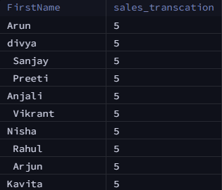

# 🍅 Sneaker Store SQL Analysis Project

Welcome to the **Sneaker Store SQL Analysis** project! This project demonstrates my skills in SQL, data analysis, and deriving insights from a relational database. The analysis explores various business questions using SQL queries on a fictional sneaker store dataset.

---

## 📂 Database Used

**Database Name**: `SNEAKERS`

**Tables Involved**:

* `CUSTOMERS`
* `PRODUCTS`
* `SALES`
* `SALES_REP`
* `SUPPLIERS`

---

## 🌍 Objectives Covered

1. Analyze overall sales performance
2. Identify top-performing sales representatives
3. Understand product and category trends
4. Compare regional sales
5. Extract customer insights
6. Explore sales by month and transaction trends

---

## 📈 Queries & Results (Screenshots in `/ss` Folder)

### 1. Total Sales by Each Sales Representative

```sql
SELECT SR.FirstName, SUM(TotalAmount) AS TOTAL_SALES
FROM SALES AS S
JOIN SALES_REP as SR ON S.SalesRepID = SR.SalesRepID
GROUP BY SR.FirstName
ORDER BY TOTAL_SALES DESC;
```

**Screenshot**: 

---

### 2. Products Sold per Store Location

```sql
SELECT S.STORELOCATION, COUNT(S.ProductID) AS PSALES
FROM SALES AS S
JOIN PRODUCTS AS P ON S.ProductID = P.ProductID
GROUP BY S.STORELOCATION;
```

**Screenshot**: 

---

### 3. Highest Total Sales by Product Category

```sql
SELECT P.CATEGORY, SUM(S.TotalAmount) AS t_SALES
FROM PRODUCTS AS P
JOIN SALES as S ON P.ProductID = S.ProductID
GROUP BY P.CATEGORY
ORDER BY t_SALES DESC LIMIT 1;
```

**Screenshot**: 

---

### 4. Average Quantity Sold per Sale

```sql
SELECT AVG(QUANTITY) AS AVG_QUAN FROM SALES;
```

**Screenshot**: 

---

### 5. Customer with Highest Purchase Count

```sql
SELECT C.FIRSTNAME
FROM CUSTOMERS AS C
JOIN SALES AS S ON C.CUSTOMERID = S.CUSTOMERID
ORDER BY S.TOTALAMOUNT DESC LIMIT 1;
```

**Screenshot**: 

---

### 6. Monthly Distribution of Total Sales

```sql
SELECT EXTRACT(MONTH FROM DATE) AS D_month, SUM(TotalAmount) as T_Sales
FROM SALES
GROUP BY D_month
ORDER BY D_month;
```

**Screenshot**: 

---

### 7. Sales Performance by Region

```sql
SELECT SUM(QUANTITY) AS s_PER, STORELOCATION
FROM Sales
GROUP BY STORELOCATION
ORDER BY s_PER DESC;
```

**Screenshot**: 

---

### 8. Sales by Product

```sql
SELECT SUM(S.TOTALAMOUNT) AS TOTAL_SALES, P.PRODUCTNAME
FROM SALES as S
JOIN PRODUCTS AS P ON S.PRODUCTID = P.PRODUCTID
GROUP BY PRODUCTNAME
ORDER BY TOTAL_SALES DESC;
```

**Screenshot**: 

---

### 9. Average Sales per Transaction

```sql
SELECT AVG(TOTALAMOUNT) as avg_sale_per_transaction FROM SALES;
```

**Screenshot**: 

---

### 10. Sales Transactions per Sales Rep

```sql
SELECT SR.FirstName, COUNT(S.SaleID) AS sales_transcation
FROM SALES AS S
JOIN SALES_REP AS SR ON S.SalesRepID = SR.SalesRepID
GROUP BY FirstName;
```

**Screenshot**: 

---

## 🔹 Skills Demonstrated

* Advanced SQL joins and aggregation
* Business problem breakdown and query planning
* Query optimization with GROUP BY and ORDER BY
* Monthly and categorical trend analysis
* Data storytelling with visuals (screenshots)

---

## 📄 How to Run

1. Clone this repository
2. Load the SQL dump into your MySQL database
3. Use any SQL tool (like DBeaver or MySQL Workbench) to run queries in `queries.sql`
4. View results and screenshots in `/ss`

---

## 🚀 Future Enhancements

* Create a dashboard using Python (Matplotlib/Seaborn)
* Convert this into an interactive web app with Flask
* Add user segmentation & product affinity analysis

---

Thanks for reading! Feel free to fork this repo or contact me for collaboration.

