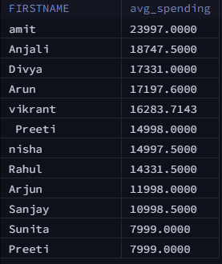
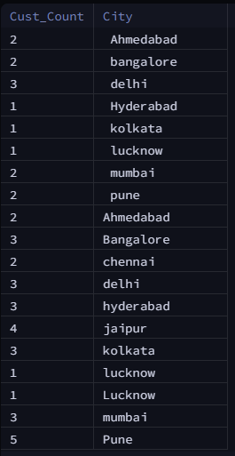
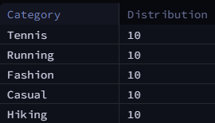
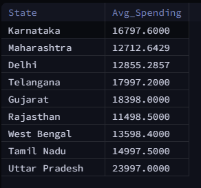

# 👟 Sneaker Sales Data Analysis

This project analyzes customer behavior, product popularity, and supplier performance using SQL on a sneaker sales dataset. The goal is to derive business insights through meaningful queries.

---

## 🧾 Database Overview

**Database Name**: `SNEAKERS`

**Tables Used**:

* `CUSTOMERS`
* `PRODUCTS`
* `SALES`
* `SUPPLIERS`

---

## 🎯 Objective 2: Customer and Product Analysis

### 1. Average Spending Per Customer

```sql
SELECT C.FIRSTNAME, AVG(S.TotalAmount) AS avg_spending
FROM customers AS C
JOIN sales AS S ON C.CustomerID = S.CustomerID
GROUP BY FIRSTNAME
ORDER BY avg_spending DESC;
```

**Screenshot**:



---

### 2. Most Frequently Purchased Product

```sql
SELECT P.ProductName, COUNT(S.ProductID) AS Frequent_Perchase
FROM sales AS S
JOIN products AS P ON S.ProductID = P.ProductID
GROUP BY P.ProductName
ORDER BY Frequent_Perchase DESC LIMIT 1;
```

**Screenshot**:


---

### 3. Unique Customers Per City

```sql
SELECT COUNT(DISTINCT(S.CustomerID)) AS Cust_Count, C.City
FROM customers AS C
JOIN sales AS S ON C.CustomerID = S.CustomerID
GROUP BY C.City;
```

**Screenshot**:



---

### 4. Distribution of Product Categories

```sql
SELECT P.Category, COUNT(*) AS Distribution
FROM products AS P
JOIN sales AS S ON P.ProductID = S.ProductID
GROUP BY Category;
```

**Screenshot**:



---

### 5. Count of Repeat Customers

```sql
SELECT COUNT(*) AS Repeated_Customer
FROM (
    SELECT CustomerID
    FROM sales
    GROUP BY CustomerID
    HAVING COUNT(SaleID) > 1
) AS Repeated;
```

**Screenshot**:


---

### 6. Average Unit Price of Purchased Products

```sql
SELECT AVG(P.UnitPrice) AS Avg_Price
FROM products AS P
JOIN sales AS S ON P.ProductID = S.ProductID;
```

**Screenshot**:


---

### 7. Spending Behavior by State

```sql
SELECT C.State, AVG(S.TotalAmount) AS Avg_Spending
FROM sales AS S
JOIN customers AS C ON C.CustomerID = S.CustomerID
GROUP BY C.State;
```

**Screenshot**:



---

### 8. Supplier with Most Popular Products

```sql
SELECT SUP.SupplierName, COUNT(DISTINCT S.ProductID) AS Product_Count
FROM products AS P
JOIN sales AS S ON S.ProductID = P.ProductID
JOIN suppliers AS SUP ON SUP.SupplierID = P.SupplierID
GROUP BY SUP.SupplierName
ORDER BY Product_Count DESC LIMIT 1;
```

**Screenshot**:


---

### 9. Most Commonly Purchased Product Category

```sql
SELECT P.Category, COUNT(S.ProductID) AS Purchased_Count
FROM sales AS S
JOIN products AS P ON S.ProductID = P.ProductID
GROUP BY P.Category
ORDER BY Purchased_Count DESC LIMIT 1;
```

**Screenshot**:


---

### 10. Customers Purchasing More Than One Product Type

```sql
SELECT COUNT(*) AS Number_Of_Customer_Purchased_More_than_one_product
FROM (
    SELECT S.CustomerID
    FROM sales AS S
    JOIN products AS P ON S.ProductID = P.ProductID
    GROUP BY S.CustomerID
    HAVING COUNT(DISTINCT S.ProductID) > 1
) AS multiple_product;
```

**Screenshot**:


---

## 🧰 Folder Structure

```
.
├── analysing_sales_performance.sql
├── README.md
├── ss/
│   ├── Q1.png
│   ├── Q2.png
│   ├── Q3.png
│   ├── Q4.png
│   ├── Q5.png
│   ├── Q6.png
│   ├── Q7.png
│   ├── Q8.png
│   ├── Q9.png
│   └── Q10.png
└── Data                            
```

---

## 💡 Skills Demonstrated

* SQL joins, grouping, and aggregation
* Customer segmentation and purchase behavior analysis
* Supplier and product trend analysis
* Clean reporting with query + visual mapping
* Organized and reusable project structure

---

Thanks for checking out this project! 🚀
